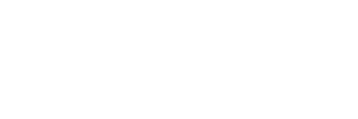

### Deux ans sur le papier ; bientôt vingt-cinq dans la réalité

Vous cherchez un formateur numérique capable de s'adapter à de multiples publics et sujets ? Un humain avant tout capable d'entendre son interlocuteur et d'adapter son discours et ses interventions aux spécificités de chacun ?

Si tel est le cas, [discutons](https://www.dubuquoy.fr/contact.html).

Formateur freelance depuis 2022, ma pratique de la médiation numérique et de la transmission de savoir remonte toutefois à _légèrement_ plus que deux ans (approximativement le début des années 2000).

### Mais pourquoi formateur "numérique" ?

Bien que je sois passé par la case (et quelques diplômes en lien avec le numérique, cf [CV](https://www.dubuquoy.fr/cv%20presqu'exhaustif.html)) _Maintenance Informatique et Assistance Utilisateurs_, je me présente en général à mes apprenants avant tout comme un **utilisateur** d'outils numériques. 
J'aime faire _"des trucs"_ avec le numérique (livres, dessins, BD, sons, musique, vidéos, jeux vidéos en gestation, fictions interactives, PAO, collages, sites, bidouilles variées...). 

Je me définis et reste avant tout **utilisateur**, avec juste quelques années de pratiques d'avance et une (quasi) insatiable curiosité, une irrépressible envie de continuer à explorer la _res numerica_. Le truc, c'est de tenter d'embrasser le numérique dans son ensemble, dans tous ses aspects et présences dans nos vies, du micro au macro. Ce n'est pas simple. Et j'ai l'impression que le terme "informatique" me limiterait au pur fonctionnement technique des machines et programmes. Alors qu'il faut aussi (re)mettre l'humain au cœur de cet imbroglio.

### Et maintenant ?

Je n'ai pu que constater tout au long de mon itinéraire ~~chaotique~~ atypique qu'il y avait un réel et fort besoin de formateurs et formations numériques en France. Alors je me suis lancé en indépendant. Mon parcours et mes pratiques parallèles me permettent de proposer un plutôt large panel d'interventions. Chaque session me permet de tester de nouvelles méthodes ou outils de transmission, de nouveaux TP, et je m'adapte sans cesse à mes apprenants. Je suis transparent avec eux. Et si une techno ou un outil en particulier les intéresse et que je ne la ou le connais pas, je le leur dis, et on découvre ensemble. L'important est de les autonomiser, de leur transmettre plus que des pratiques à reproduire en copier/coller, leur faire intégrer une méthodologie.

De mon passage en dev et mes pratiques de fictions interactives, me restent la logique, l'appétence, l'adaptabilité et la faculté aussi bien de réaliser ce genre de mini-sites (merci [Scribouilli](https://scribouilli.org/), cf [Mes méthodes](https://www.dubuquoy.fr/mes%20methodes.html) pour plus d'infos) que des Wordpress ou tester d'autres bibliothèques et/ou CMS pour initier mes apprenants à des technologies ou méthodes qui pourraient les intéresser.

### Maintenir le contact humain

En deux ans de formateur numérique freelance, j'ai pu participer à l'animation de sessions "Découvertes informatiques" abordant aussi bien les techniques de base de la maintenance informatique que l'initiation au développement web et j'anime actuellement une formation de Techniciens d'Assistance Informatique.

La méthode reste la même : envelopper le tout dans de la culture numérique au sens plus large : transversalité, enjeux, nécessité d'apprendre, savoir-faire, savoir-être, savoir-devenir.

Je recroise encore parfois certains anciens apprenants. Ils sont heureux d'avoir croisé ma route. Et moi la leur.  

 